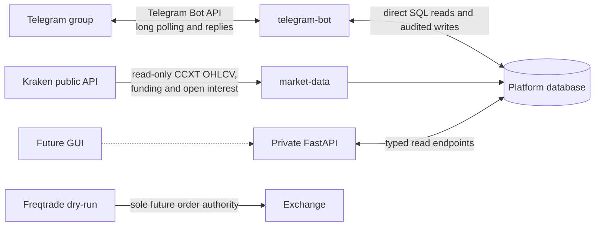

# Private cryptocurrency strategy platform

This repository is the first, deliberately fail-closed phase of a private Freqtrade research platform. It supplies deterministic FVG/sweep/structure/SMT/bias/scoring/risk primitives, setup lifecycle and telemetry, a private FastAPI surface, PostgreSQL persistence, Docker deployment, backups, and a thin Freqtrade strategy adapter. It is spot-only and dry-run-only. It is research software, not financial advice.

Current conformance status is tracked in [the work-order audit](docs/WORK_ORDER_AUDIT.md). Implementation has advanced through the research workstation and gated shadow boundary, but Phase 4 evidence has not passed; Freqtrade entries and the GUI dry-run lifecycle remain intentionally locked. PostgreSQL is the supported runtime and local-development database; the legacy root `platform.db` is retained only as a read-only replay source and is not an application database.

## Table of contents

- [Desktop app (Ubuntu `.deb`)](#desktop-app-ubuntu-deb)
- [Local development](#local-development)
- [Docker/private server](#dockerprivate-server)
- [Safety and scope](#safety-and-scope)
- [Running the local research stack](#running-the-local-research-stack)
- [Read-only GUI workstation](#read-only-gui-workstation)
- [Timeframes and indicator configuration](#timeframes-and-indicator-configuration)
- [Telegram bot guide](#telegram-bot-guide)
  - [Candidate and watchlist workflow](#candidate-and-watchlist-workflow)
  - [Guided button menus](#guided-button-menus)
  - [Manual and automatic backfills](#manual-and-automatic-backfills)
  - [Indicators](#indicators)
  - [Indicator alerts](#indicator-alerts)
  - [Research setup lifecycle](#research-setup-lifecycle)
- [How the bot interacts with APIs](#how-the-bot-interacts-with-apis)
  - [Data flow by command](#data-flow-by-command)
- [Testing and documentation](#testing-and-documentation)

## Desktop app (Ubuntu `.deb`)

For a one-click Ubuntu workstation install, see [docs/DESKTOP.md](docs/DESKTOP.md).

```bash
# Build locally, or download from GitHub Releases (v* tags)
make deb
sudo apt install ./dist/trademonke_*_amd64.deb
# Open TradeMonke from the app menu — first launch clones the repo, builds images, starts the GUI
```

Updates track `origin/main` via git inside `/opt/trademonke` (the `.deb` is a thin bootstrap).

## Local development

```bash
python3 -m venv .venv
. .venv/bin/activate
pip install -e '.[dev]'
cp .env.example .env
pytest
uvicorn app.api.main:app --reload
curl http://127.0.0.1:8000/health
```

## Docker/private server

```bash
cp .env.example .env
# Replace POSTGRES_PASSWORD before continuing.
docker compose config
docker compose run --rm migrate
docker compose up -d platform-api
curl http://127.0.0.1:8000/health
```

Freqtrade is intentionally separate from initial API startup. Inspect and change its placeholder REST password, then start it with `docker compose up -d freqtrade`. It starts stopped and remains dry-run. Download candles and backtest using [the research workflow](docs/BACKTESTING.md); server paths, backup/restore, and migration are in [deployment](docs/DEPLOYMENT.md). For Heroku, see the [relay-only GUI section](docs/DEPLOYMENT.md#heroku-relay-only-gui) in the deployment document. Local collection, Postgres, and `relay-agent` push workstation snapshots to the remote face; use `make start-local-brain` after seeding from `platform.db`.

## Safety and scope

- Freqtrade is the only order authority; there is no direct CCXT executor.
- API settings reject live or non-spot configuration.
- The adapter cannot currently reach six points because aligned SMT is intentionally unwired, so it emits no entries.
- The v6.2 Pine file was available, not the requested v6.3. See [strategy decisions](docs/STRATEGY_SPEC.md) and [roadmap](docs/ROADMAP.md).

Useful commands: `make test`, `make lint`, `make compose-check`, `make migrate`, and `make strategy-check`.

GitHub Actions runs tests, Ruff, Compose rendering, and a clean PostgreSQL migration boot/idempotency check on pull requests and pushes to `main`. CI and the application image install against the exact Python 3.12 constraints in `requirements.lock`; update and verify that file intentionally when dependencies change. Database upgrades use the tracked one-shot `migrate` service rather than PostgreSQL first-boot scripts or application-time `create_all`. Migration filenames and checksums are recorded in `schema_migrations`; modifying an applied migration fails closed.

Research provenance uses a canonical, versioned event envelope with deterministic event IDs, correlation and causation, UTC event/recording times, software versions, market identifiers, decision reasons, typed measurements, and safe operational metadata. The research schema includes stable liquidity levels and events, materialized episodes and append-only transitions, FVG/IFVG geometry, feature snapshots, gate and risk evaluations, recommendations, plans, order/trade events, outcomes, run manifests, incidents, GUI actions, alert acknowledgements, and reproducible chart manifests. These are storage and inspection contracts; the ordered liquidity episode detector remains a later phase and no new execution path has been enabled.

Versioned workstation contracts are available at `/api/v1/gui/bootstrap`, `/api/v1/gui/chart/{symbol}?timeframe=5m`, `/api/v1/gui/ws`, and `/api/v1/events/stream`. The market-data service consumes Kraken's public WebSocket v2 ticker and OHLC channels and relays normalized `live-price.v1` BBO-midpoint and `live-candle.v1` forming-candle frames over the backend-only network. The authenticated API socket multiplexes those frames with changed `workstation.v1` database snapshots and transport heartbeats; the browser reconnects and resubscribes automatically. Authentication is sent in the first GUI socket message so the token is not exposed in URLs or proxy logs. Live prices and forming candles are marked `authoritative=false`, are never persisted, and are never passed to detection, lifecycle, scoring, risk, recommendations, or execution. All authoritative calculations continue to use persisted closed candles only. Event-stream payloads declare `events.v1`, schema version, stable event ID, ordering sequence, occurrence time, and correlation ID.

The current research strategy version is `fvg-pro-elite-python-v0.2.0`, incremented for the current-eligibility downgrade and pause/kill lifecycle rule changes. Historical records retain their original version.

Public research data is configured for one year of Kraken `BTC/USDT` and `ETH/USDT` candles. Kraken is also the dry-run Freqtrade venue so the initial research and execution paths do not silently introduce cross-venue basis risk. See [market-data operations and watchlist admission](docs/MARKET_DATA.md). No API key is required for public research data.

In Compose, PostgreSQL is attached only to the internal `backend` network. Market data, Telegram, and Freqtrade also attach to the `outbound` network for their required public API access. Published API ports remain bound to loopback. Platform application settings consistently use the `PLATFORM_` prefix; copy names directly from `.env.example`.

## Running the local research stack

Complete the initial historical load once:

```bash
. .venv/bin/activate
market-data backfill
```

After it finishes, keep the collector and Telegram service running in separate terminals:

```bash
# Terminal 1: public exchange data
. .venv/bin/activate
market-data run --poll-seconds 30
```

```bash
# Terminal 2: Telegram commands
. .venv/bin/activate
telegram-bot
```

The private HTTP API is optional for the current Telegram implementation, but useful for local inspection and a future GUI. Its health response is derived from database connectivity, persisted pause/kill controls, candle freshness, service heartbeats, and version metadata; it reports `degraded` when feeds are empty/stale or recorded services stop heartbeating:

```bash
# Terminal 3: optional API
. .venv/bin/activate
uvicorn app.api.main:app --host 127.0.0.1 --port 8000
curl http://127.0.0.1:8000/health
curl http://127.0.0.1:8000/market-data/status
curl http://127.0.0.1:8000/events
curl http://127.0.0.1:8000/liquidity-levels
curl http://127.0.0.1:8000/episodes
curl http://127.0.0.1:8000/api/v1/gui/bootstrap
curl 'http://127.0.0.1:8000/api/v1/gui/chart/BTC%2FUSDT?timeframe=5m'
```

## Read-only GUI workstation

The React/TypeScript workstation is a desktop-first research surface for the canonical backend. It provides a database-backed watchlist, candlestick chart, liquidity levels, setup progress, backend-approved entry/stop/target overlays, persisted controls, and recommendation provenance. The UI calls strategy episodes “Potential setups” and translates canonical lifecycle values into familiar trading labels while retaining the stored state unchanged. Each long or short idea can be independently shown on the chart; one focused idea drives the progress timeline and research plan inspector. The chart evidence deck gives the six stored closed-candle components readable names, long/short score context, pass/missing state, evidence summaries, and show/hide controls. Separate presentation-only layer controls toggle liquidity levels, FVG regions, approved entry regions, structural stop loss, and profit targets; no missing geometry is fabricated. It performs no signal, risk, sizing, target, or execution calculations in browser code and contains no exchange credentials or mutation controls.

Set a long random `PLATFORM_GUI_ACCESS_TOKEN` in the real `.env` before startup. GUI APIs fail closed when it is absent and use constant-time token comparison. The browser keeps the token only in `sessionStorage` and sends it as `X-GUI-Token`; nginx and FastAPI remain loopback-bound. The workstation includes persisted health/service state and an alert centre whose acknowledgements are stored and written to the GUI action audit trail.

Run it locally with the API:

```bash
make start
# `make run` is an equivalent alias.
# Open http://127.0.0.1:3000
```

`make start` requires an existing `.env`. It preserves a backup and generates only
missing or placeholder PostgreSQL/GUI secrets; configured Telegram credentials remain
untouched. It validates the Compose configuration, applies database migrations, and
starts and verifies the API, GUI, and continuous market-data collector. Start Telegram
separately with `make start-telegram` after its token and allowlist have been verified.
Freqtrade remains stopped. The targets support both the modern
`docker compose` plugin and the legacy `docker-compose` command.
Use `make gui-token` to display the current local workstation login token or
`make rotate-gui-token` to replace only that token without changing Telegram settings.
Run `make verify-gui-stream` to authenticate through nginx and verify that a
`workstation.v1` snapshot containing closed candles is available over WebSocket.

For frontend development:

```bash
cd gui
npm ci
npm run dev
```

The production container builds pinned dependencies from `package-lock.json`, serves static assets through nginx, proxies canonical HTTP and WebSocket endpoints to FastAPI, and binds the workstation to loopback. CI type-checks/builds the GUI and rejects high-severity dependency advisories. Episode replay reads the append-only timeline; chart overlays render stored backend geometry and never become authoritative calculations. The header distinguishes workstation transport connectivity from actual Kraken market-frame freshness. The toolbar and watchlist display Kraken's streamed BBO midpoint. The chart adds a non-authoritative forming candle only when Kraken sends a trade-driven OHLC frame newer than the latest authoritative closed candle.

## Reproducible baseline research

Run `make research-baseline` only after outcome labels and decision-time feature snapshots have been populated. The command deterministically orders examples by timestamp and episode ID, creates non-overlapping 60% development, 20% validation, and 20% untouched-test partitions, runs expanding-window walk-forward summaries and component ablations on development plus validation only, seals the untouched episode IDs, and writes a content-addressed `baseline.v1` artifact under `runtime/research`. The database run manifest records the dataset SHA-256, safe configuration hash, Git SHA, strategy version, dependency-lock hash, split policy, and artifact path.

Generate a complete reconstruction with `research review-bundle EPISODE_ID`. The `review-bundle.v1` export includes the ordered transition timeline, originating liquidity level, imbalances, decision-time features, mandatory gates, risk decisions, recommendation history, related alerts, and software provenance. Empty or insufficient datasets produce explicit sample sizes rather than performance claims. Hyperparameter search, FreqAI, and execution remain prohibited until the required historical evidence exists and is reviewed.

## Shadow execution boundary

`PLATFORM_EXECUTION_MODE` defaults to `disabled`. Shadow intent creation requires an explicitly reviewed baseline run manifest with a sealed untouched test, clear persisted pause/kill controls, a research-approved versioned trade plan, and an explicit disconnected execution flag. Shadow records contain the proposed Freqtrade-authority geometry and size but always store `submitted=false`; reconciliation records the observed fill/slippage counterfactual idempotently.

The `dry_run` adapter mode intentionally fails closed until reviewed shadow reconciliation exists. The Freqtrade strategy currently writes `enter_long=0` unconditionally, starts stopped, remains spot-only/dry-run-only, and is not connected to platform intents. Therefore this repository has implemented the shadow boundary but has **not passed the work-order gate for Freqtrade dry-run submission**. Enabling submission before real baseline and shadow evidence would contradict the governing specification.

The authenticated GUI operator console displays persisted controls, execution mode, approved plan geometry, shadow and reconciliation events, and the explicit dry-run lock reason. In shadow mode an authorized operator may request an idempotent non-submitted intent and record a would-fill/slippage observation. Every accepted or rejected action is appended to `gui_action_events`. The console deliberately provides no dry-run submission, fabricated fill, stop-change, or exit control until the research and shadow gates pass.

Only one `telegram-bot` process may run for a token. Telegram returns a polling conflict if a second local process, Docker service, or another `getUpdates` consumer is active.

## Timeframes and indicator configuration

Default research configuration:

| Setting | Default | Purpose |
| --- | --- | --- |
| `PLATFORM_MARKET_DATA_EXCHANGE` | `kraken` | Shared initial research and Freqtrade dry-run venue |
| `PLATFORM_MARKET_DATA_SYMBOLS` | `BTC/USDT,ETH/USDT` | Protected initial research anchors |
| `PLATFORM_MARKET_DATA_TIMEFRAMES` | `5m,15m,30m,1h,4h,1d` | Candle streams collected for every active/probe asset |
| `PLATFORM_INDICATOR_BASE_TIMEFRAME` | `5m` | Closed candle that triggers indicator and setup evaluation |
| `PLATFORM_INDICATOR_HTF_TIMEFRAMES` | `15m,30m,1h,4h,1d` | Timeframes that must all align for HTF bias |
| `PLATFORM_INDICATOR_EMA_LENGTH` | `50` | EMA length on every HTF |
| `PLATFORM_INDICATOR_STRUCTURE_LOOKBACK` | `10` | Prior base candles used for close-confirmed structure breaks |
| `PLATFORM_INDICATOR_SMT_LOOKBACK` | `10` | Base candles used for BTC/ETH divergence |
| `PLATFORM_INDICATOR_PIVOT_LOOKBACK` | `30` | Base-candle window searched for confirmed sweep levels |
| `PLATFORM_INDICATOR_FVG_MAX_AGE` | `40` | Base candles before an FVG expires |
| `PLATFORM_SETUP_DETECTION_MIN_SCORE` | `2` | Score that creates a setup without a contextual one-component trigger |
| `PLATFORM_SETUP_EXPIRY_CANDLES` | `40` | Base candles before an unresolved setup expires |
| `PLATFORM_LIQUIDITY_PIVOT_LEFT` | `2` | Closed candles required left of a pivot |
| `PLATFORM_LIQUIDITY_PIVOT_RIGHT` | `2` | Closed candles required after a pivot before it becomes observable |
| `PLATFORM_LIQUIDITY_CLUSTER_TOLERANCE_BPS` | `5` | Maximum distance for grouping equal levels |
| `PLATFORM_LIQUIDITY_TOUCH_TOLERANCE_BPS` | `2` | Near-level distance recorded as a touch |
| `PLATFORM_LIQUIDITY_EXPIRY_CANDLES` | `500` | Maximum active lifetime after confirmation |
| `PLATFORM_EPISODE_DISPLACEMENT_BODY_BPS` | `20` | Minimum directional candle body after reclaim |

Add overrides to `.env`, then restart `market-data`. The collected timeframe list must include the base timeframe and every HTF; startup fails with an explicit error if it does not.

Example 15-minute base research configuration:

```dotenv
PLATFORM_MARKET_DATA_TIMEFRAMES=15m,30m,1h,4h
PLATFORM_INDICATOR_BASE_TIMEFRAME=15m
PLATFORM_INDICATOR_HTF_TIMEFRAMES=30m,1h,4h
PLATFORM_INDICATOR_EMA_LENGTH=50
PLATFORM_SETUP_EXPIRY_CANDLES=40
```

Changing these values affects new indicator snapshots and setup evaluations; existing historical records retain their original timeframe and strategy version. Backfill any newly added timeframe before relying on HTF bias. The default 4h and daily (`1d`) EMA-50 inputs require at least 50 completed candles each. Including them is a configured research extension beyond the Pine v6.2 15m/30m/1h reference. These settings configure the database research engine only—the current Freqtrade adapter still has its own fixed 5m/15m/30m/1h reference behavior and remains execution-inert.

While `market-data run` is active, an hourly self-healing audit checks every active and probe symbol against the configured timeframe list and history depth. Newly added watchlist items and newly configured timeframes are backfilled automatically in the background. Disabled symbols are excluded. The Telegram sync-all button runs the same audit immediately.

## Telegram bot guide

Create a bot with BotFather and configure these local `.env` values:

```dotenv
TELEGRAM_BOT_TOKEN=REPLACE_WITH_ROTATED_BOT_TOKEN
TELEGRAM_CHAT_ID=-4971328803
PLATFORM_TELEGRAM_ALLOWED_USER_IDS=123456789,987654321
```

The chat ID restricts the bot to one private group. The allowlist independently controls which group members may issue commands. Group membership alone does not grant access. Never commit `.env`, share the token, or include it in screenshots. Revoke the token through BotFather if it is exposed.

When Telegram privacy mode is enabled, address commands to the bot in a group, for example:

```text
/health@trade_monke_bot
```

Every time `telegram-bot` starts, it calls Telegram's `setMyCommands` endpoint with the commands implemented by this repository. The slash-command menu therefore updates automatically after code changes and a service restart; manual BotFather `/setcommands` maintenance is not required.

Available commands:

| Command | Purpose |
| --- | --- |
| `/menu` | Open the guided button interface |
| `/health` | Database, feed freshness, service heartbeats, persisted controls, and version state |
| `/status` | Pause state, kill switch, trading mode, and exchange |
| `/watchlist` | Active, probe, disabled, and protected assets |
| `/marketdata` | Latest stored closed candle per pair and timeframe |
| `/candidates` | Latest exchange-volume and spread screening results |
| `/candidate SOL/USDT` | Evidence and admission readiness for one asset |
| `/backfill` | List recent historical jobs and progress |
| `/backfill SOL/USDT` | Latest job for one symbol, timeframe, row count, and errors |
| `/backfill request SOL/USDT 365 5m,15m,30m,1h` | Create a confirmed manual backfill request |
| `/backfill confirm br_12345678` | Confirm a pending manual backfill request |
| `/indicators BTC/USDT` | Current long/short six-component state and score |
| `/alerts` | Your alert subscriptions in the configured group |
| `/alerts enable BTC/USDT` | Enable all component transitions, with a default 4/6 score threshold |
| `/alerts disable BTC/USDT` | Disable that symbol's alerts without deleting its settings |
| `/alerts component BTC/USDT fvg_retest` | Switch from all components to a selected component list, or toggle it |
| `/alerts score BTC/USDT 5` | Set score/state notifications to a minimum of 5/6 |
| `/setups` | Up to ten active recorded strategy setups |
| `/setup stp_...` | Current state, score, component checklist, and timestamps |
| `/why stp_...` | Passing/missing evidence, gates, and recent transition reasons |
| `/strategy` | Strategy version, Git revision, and execution mode |
| `/pause` | Persistently block new research setups and entries |
| `/resume` | Resume after a normal pause; refused while the kill switch is active |
| `/kill confirm` | Persistently engage the kill switch and pause new processing |
| `/help` | Display the command guide in Telegram |

The kill switch cannot be cleared through Telegram. This prevents a compromised chat account from re-enabling entries. Data collection and risk-management exits remain independent of Telegram availability.

### Guided button menus

Use `/menu` for buttons covering indicators, alerts, backfills, watchlist assets, setups, health, and help. Symbol choices are loaded from the persistent watchlist, so newly confirmed probes appear automatically.

Contextual entry points are also available:

```text
/alerts menu
/indicators menu
/backfill menu
/watchlist menu
```

- Alerts offers all indicator changes, setup-only alerts, enable/disable, and one-tap setup thresholds of 2/6, 4/6, 5/6, or 6/6.
- Indicators runs the symbol report without typing its argument.
- Backfills shows progress and offers 30-day hourly or 365-day full-research jobs.
- Watchlist offers the state changes allowed for the selected asset.
- Setups offers `Details` and `Why?` buttons for active setup IDs.

Mutations remain two-step operations. The first button creates an expiring request and the second `Confirm` button carries its internal `ch_...` or `br_...` ID. Copying IDs is unnecessary, though typed confirmation commands remain available. Callback presses enforce the same configured group and individual-user allowlists as slash commands.

The backfill menu lists every active/probe asset's latest status and includes `Sync missing history for all`. Sync performs a coverage audit rather than blindly redownloading everything: it queues only absent or materially incomplete configured timeframes, reuses active jobs, respects completed best-available exchange history, and gives recent failures a one-hour retry cooldown.

### Candidate and watchlist workflow

Candidate screening is advisory. A liquid market is not automatically added to strategy evaluation.

```text
/candidates
/candidate SOL/USDT
/watchlist probe SOL/USDT
```

The probe request returns a short-lived change ID. Confirm it within 15 minutes:

```text
/watchlist confirm ch_12345678
```

A probe asset is collected for research but is not active for strategy execution. Promotion requires a current liquidity snapshot, acceptable spread, and at least 95% coverage of 30 days of hourly candles:

Confirming a probe automatically queues one year of `5m`, `15m`, `30m`, and `1h` history. The market-data service processes that job in the background while live polling continues. Check progress with:

```text
/backfill SOL/USDT
/candidate SOL/USDT
```

An operator can also queue and run a targeted job locally for an existing active or probe asset:

```bash
market-data backfill-symbol SOL/USDT --days 365
```

The command is idempotent at the candle-storage layer. A running or pending job for the same exchange and symbol is reused rather than duplicated. Interrupted jobs are returned to `pending` when the continuous collector restarts.

Promotion requires a current liquidity snapshot, acceptable spread, and at least 95% coverage of 30 days of hourly candles:

```text
/watchlist add SOL/USDT
/watchlist confirm ch_87654321
```

Removal stops new collection after the collector reloads its database-backed list, but preserves candles and research history:

```text
/watchlist remove SOL/USDT
/watchlist confirm ch_abcdef12
```

`BTC/USDT` and `ETH/USDT` are protected anchors and cannot be removed through Telegram.

### Manual and automatic backfills

Probe confirmation automatically queues a one-year backfill. To request a new or customized backfill for an existing active or probe symbol through Telegram:

```text
/backfill request SOL/USDT 365 5m,15m,30m,1h
```

The response contains a request ID that expires after 15 minutes:

```text
/backfill confirm br_12345678
```

Monitor the resulting job:

```text
/backfill SOL/USDT
```

The request is rejected if the symbol is disabled/untracked, the day range is outside 1–3650, or a timeframe is unsupported. If the same symbol already has a pending/running job, confirmation reuses it. Backfills do not alter watchlist status.

### Indicators

The continuous `market-data` process evaluates indicators after updating a tracked symbol. It uses completed candles only and creates one long and one short snapshot per new base-timeframe candle. At least 50 candles on every configured higher timeframe are required before HTF bias can pass.

```text
/indicators BTC/USDT
```

Each direction reports a score and these six components:

| Component | Current mechanical interpretation |
| --- | --- |
| `htf_bias` | 15m, 30m, and 1h closes all aligned relative to EMA-50 |
| `liquidity_sweep` | Current wick crosses the latest confirmed pivot and closes back inside |
| `fvg_retest` | Current price overlaps a still-valid, non-expired directional FVG |
| `retest_confirmation` | Directional close beyond FVG midpoint and prior close |
| `smt` | Lookback extreme disagreement against ETH for BTC, and BTC for other assets |
| `structure` | Completed-candle close beyond the prior ten-candle extreme |

The engine stores raw EMA values, sweep level, FVG boundaries/status, SMT comparison/data quality, and structure lookback alongside each boolean. Missing comparison or HTF data fails closed rather than becoming positive. Scores map to developing (0–3), watch (4), strong watch (5), and eligible (6), but the current Freqtrade adapter still cannot execute these database snapshots.

The persistent liquidity map uses completed candles only. A pivot becomes observable only after the configured right-side confirmation delay. Stable swing/equal-high/equal-low records retain Decimal geometry, cluster size, touch count, provenance, and status. Later closed candles append idempotent touch, sweep, accepted-breakout, or expiry events. A wick through followed by a close back inside is labelled a sweep; a close beyond is labelled an accepted breakout. These are observable price labels, not claims about participant intent.

The ordered episode engine links each recorded sweep to one persistent episode and advances it across later closed candles through `swept → reclaimed → displaced → imbalance_created → retested`. Recovery uses a close back on the valid side of the originating level; displacement requires a configurable directional body; the imbalance must be a directional FVG formed after displacement; and retest requires overlap plus a midpoint-side close. Current and highest states are stored separately and every transition carries reason codes and measurements. Execution remains disconnected in this phase.

After retest, qualification evaluates six mandatory gates independently: liquidity event, recovery/displacement, linked imbalance, entry condition, invalidation/target geometry, and execution quality. Every gate stores raw inputs, thresholds, reason codes, and data quality. All six must currently pass to arm an episode; later failure disarms it while retaining the highest state reached. Contextual evidence cannot replace a mandatory gate.

The risk governor has final authority over an armed episode. It uses Decimal arithmetic to validate stop/target side, minimum reward-to-risk, spread, slippage, persisted controls, account-risk sizing, minimum notional, and maximum-notional capping. Approval and rejection inputs, limits, size calculations, and reasons are persisted. Approval changes the research episode to `approved`, but still creates no order and does not connect Freqtrade.

A risk-approved episode can produce a versioned backend recommendation. It contains the linked FVG entry region, structural invalidation stop, up to three ordered opposing-liquidity profit boxes with R multiples, approved size, breakeven-after-TP1 trigger, and a confirmed-structure trailing policy that may never move away from safety. Each recommendation records source rules and object IDs, validity, supersession, strategy/config/code provenance, and its risk evaluation. The associated trade plan explicitly stores `execution_connected=false`; these records are recommendations for research inspection, not orders.

The continuous collector now orchestrates the research path after every new base candle. A retested episode receives one idempotent decision-time feature snapshot; qualification requires fresh candidate spread evidence, clear controls, a linked retested imbalance, and structural geometry meeting minimum R:R. Passing episodes are risk-evaluated and receive a versioned recommendation automatically. Later candles label target-first or conservatively stop-first outcomes with MAE/MFE. This orchestration never invokes the execution adapter.

Snapshots appear only while `market-data run` is active and after sufficient history exists. `/indicators` reports “no snapshot” until those prerequisites are met.

### Indicator alerts

Indicator-component alerts are opt-in per user and symbol:

```text
/alerts enable BTC/USDT
/alerts score BTC/USDT 4
/alerts
```

Default enablement listens for every component transition and sends score/state changes at 4/6 or higher. To restrict component changes, toggle the desired components:

```text
/alerts component BTC/USDT liquidity_sweep
/alerts component BTC/USDT fvg_retest
/alerts component BTC/USDT structure
```

Supported component names are `htf_bias`, `liquidity_sweep`, `fvg_retest`, `retest_confirmation`, `smt`, and `structure`. Once a specific component is selected, the wildcard subscription is replaced by the explicit list. Repeating a component command removes it.

Events are generated only when a stored value changes between completed candles. Deterministic event IDs prevent repeated alerts for the same symbol, candle, direction, and component. The Telegram service marks each event processed after evaluating subscriptions, so enabling alerts does not replay old historical changes. Delivery can lag by up to one Telegram polling interval.

Alert subscriptions do not enable execution. `/pause` and `/kill confirm` remain independent persistent controls, and the live-trading guard remains active.

Setup lifecycle alerts are different: they are **enabled automatically at 4/6** for every `active` or `probe` watchlist symbol. Near misses below 4/6 are retained silently. No `/alerts enable` command is needed. The newest explicit group preference wins:

```text
/alerts disable SOL/USDT
```

This suppresses automatic setup alerts and explicit indicator alerts for SOL. Restore them with:

```text
/alerts enable SOL/USDT
```

Configure a symbol from `/alerts menu` using the `Setup ≥2`, `Setup ≥4`, `Setup ≥5`, or `Setup =6` buttons, or type `/alerts score SYMBOL 0-6`. The selected minimum applies to setup and score/state alerts. Once a setup has reached the threshold, later expiry, invalidation, or cancellation uses its prior achieved score so the terminal alert is not lost when the current score falls. Because Telegram delivery is group-shared, the newest authorized preference controls the group.

`/alerts` reports every watchlist asset, including those with no explicit subscription row. It distinguishes effective automatic setup coverage from the requesting user's indicator filters, for example:

```text
BTC/USDT [active]: setup=ON(explicit≥5); indicators=*; score≥5
ETH/USDT [active]: setup=ON(default≥4); indicators=off
SOL/USDT [probe]: setup=ON(default≥4); indicators=off
```

### Research setup lifecycle

The setup engine converts each new long/short indicator snapshot into a research record when evidence becomes meaningful. The default trigger is score 2/6 or any sweep, FVG retest, retest confirmation, or structure event. This retains near misses without storing every empty candle as a setup.

```text
/setups
/setup stp_1234567890abcdef1234
/why stp_1234567890abcdef1234
```

A deterministic ID is derived from exchange, symbol, timeframe, direction, and the episode's first candle. Later candles update the same setup rather than creating duplicate alerts. Current state normally follows this evidence scale:

```text
detected → developing → watch → strong_watch → eligible
```

Scores map to developing below 4, watch at 4, strong watch at 5, and eligible at 6. `current_state` is recalculated from current closed-candle evidence and may downgrade when gates weaken; `highest_state_reached` separately preserves historical progress. It expires after 40 base-timeframe candles by default. An actionable watch/strong/eligible setup invalidates when all six current components become false. Every creation, promotion, downgrade, disarm, expiry, invalidation, or cancellation stores a timestamped reason.

Pause and kill state are checked before setup processing, not only before eligibility. While either control is active, new setups are not created and existing non-eligible setups are not updated. A currently eligible setup is disarmed to strong watch at its next closed-candle evaluation while `highest_state_reached=eligible` is retained. These records remain research-only: `execution_connected` is always false and no setup is sent to an order executor.

Setup transitions default to alerts at 4/6 and use deterministic delivery deduplication. The setup engine still retains lower-score near misses for research even when Telegram remains quiet.

## How the bot interacts with APIs



There are two different APIs:

1. **Telegram Bot API:** `telegram-bot` uses long polling to receive group commands and sends formatted replies. The bot token is embedded in Telegram request URLs, so HTTP transport logging is suppressed.
2. **Platform FastAPI:** this private, loopback-bound HTTP API exposes health, setups, canonical events, liquidity levels, ordered episodes and their event timelines, plus market-data freshness for local tools and a future GUI.

The Telegram service currently reads and writes the platform database directly; it does not call FastAPI. This keeps local operation simple, but both surfaces use the same persisted records. The market-data collector independently calls Kraken through an unauthenticated, read-only CCXT client. It never receives trading credentials and contains no order methods.

Freqtrade is separate from all three components. It remains the only component permitted to submit or modify orders, and the current strategy is deliberately incapable of producing an entry. Telegram commands cannot enable live mode.

### Data flow by command

- `/health` and `/marketdata` read candle timestamps written by `market-data`.
- `/candidates` reads hourly public-ticker evidence snapshots written by `market-data`.
- `/watchlist ...` writes audited pending and confirmed changes to the database; the collector reloads active and probe symbols on its next poll cycle.
- Probe confirmation queues a persistent historical job; `/backfill` reads its live progress while the collector's background worker fills it.
- `/backfill request` creates a short-lived request; `/backfill confirm` converts it into an idempotent persistent job without changing watchlist status.
- `/indicators` reads the latest long and short snapshots produced after closed-candle collection.
- `/alerts ...` stores per-user subscriptions; `telegram-bot` matches undelivered transition events and posts each qualifying event once.
- `/setups`, `/setup`, and `/why` read lifecycle records now written after every meaningful closed-candle snapshot; no command can execute them.
- `/pause`, `/resume`, and `/kill confirm` write persistent control and audit records. Strategy integration must consult these controls before new entries.

For deeper operational details, see [Telegram security and behavior](docs/TELEGRAM.md), [market data and admission rules](docs/MARKET_DATA.md), and [architecture boundaries](docs/ARCHITECTURE.md).

## Testing and documentation

```bash
make test
make lint
make compose-check       # requires Docker
make strategy-check      # requires Docker/Freqtrade image
```

Additional references:

- [Architecture](docs/ARCHITECTURE.md)
- [Strategy specification](docs/STRATEGY_SPEC.md)
- [Data model](docs/DATA_MODEL.md)
- [Market data](docs/MARKET_DATA.md)
- [Telegram](docs/TELEGRAM.md)
- [Backtesting](docs/BACKTESTING.md)
- [Deployment](docs/DEPLOYMENT.md)
- [Security](docs/SECURITY.md)
- [Roadmap](docs/ROADMAP.md)
