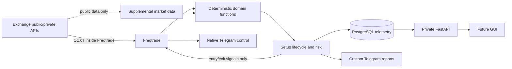

# Architecture

The MVP has one execution authority: Freqtrade. The platform API owns research records and presentation; deterministic domain modules own calculations; PostgreSQL owns platform telemetry. The direct CCXT collector is read-only, rate-limited, and isolated from credentials and order paths. Freqtrade remains the canonical execution feed; directly collected candles carry provenance and support research and pre-admission screening.

The current Freqtrade adapter deliberately cannot create an entry until all six components pass; SMT is not yet wired into its dataframe and is therefore false, making execution inert even in dry-run. This is a fail-closed integration milestone, not claimed strategy completion.

All actionable computations use completed candles. Confirmed pivots require right-side candles and only become observable after that confirmation delay. Platform services are bound to loopback. PostgreSQL is attached only to the internal backend network; services that require exchange or Telegram access also attach to a separate outbound network.

The read-only React workstation is served by a separate nginx container on the internal backend network and a loopback-only host port. It consumes versioned FastAPI bootstrap, chart, recommendation, episode-event, and SSE contracts. Browser code renders stored geometry and timelines only; domain calculations and all credentials remain server-side. No GUI execution or geometry-mutation endpoint exists in this phase.

GUI routes require a dedicated server-side access token and fail closed if it is missing. Alert acknowledgements are the only current GUI mutation: they do not affect strategy or execution, are idempotent per alert/user, and append an authenticated operator-action audit record. Health and control state are read from canonical backend persistence.
